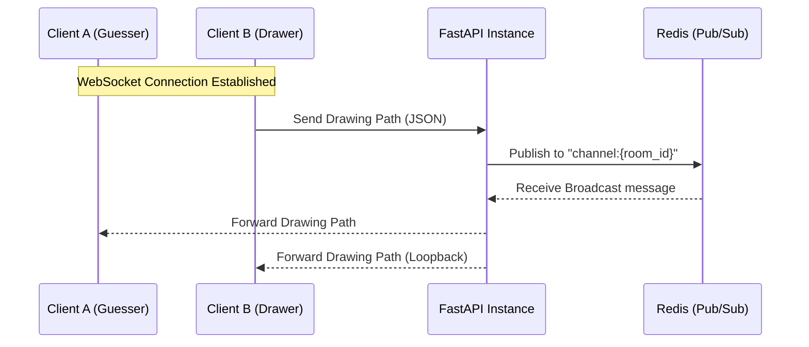

# Sketch & Guess: Backend Logical Workflow

This document outlines the architecture and logical flow of the Sketch & Guess backend, powered by **FastAPI**, **Redis**, and **SQLAlchemy**.

## 🏗️ Architecture Overview

The backend is designed for high-concurrency real-time interaction using a distributed state model.

- **FastAPI**: Handles RESTful endpoints and WebSocket connections.
- **Redis**: Acts as a state cache and a Pub/Sub message broker. This allows multiple backend instances to share game state and broadcast messages to all connected clients.
- **SQLite/SQLAlchemy**: Provides persistent storage for player stats and total scores.

---

## 🔄 Room & Game Lifecycle

### 1. Room Creation & Joining
- **POST `/create-room`**: Generates a unique Room ID, initializes the `Room` object in memory and Redis.
- **POST `/join-room`**: Adds a player to the room list. If the server was restarted, it attempts to "rehydrate" the room from Redis.

```python
# main.py: Rehydration logic during WS connection
if room_id not in rooms:
    room_data = await redis_manager.get_room(room_id)
    if room_data:
        rooms[room_id] = Room(**room_data)
```

### 2. Game Start
- **POST `/start-game/{room_id}`**:
    1. Sets room status to `IN_PROGRESS`.
    2. Broadcasts a `game_start` event via Redis Pub/Sub.
    3. Triggers the first turn.

### 3. Turn Logic
Inside `game_manager.py`, turn transitions follow this flow:
1. **Drawer Rotation**: The next player in the list becomes the `current_drawer`.
2. **Word Selection**: A random word is picked.
3. **Broadcasting**:
    - The drawer receives the full word.
    - Other players receive a "masked" version (e.g., `_ _ _ _`).
4. **Timer Initiation**: A background task kicks off a 60-second countdown.

```python
# game_manager.py: Rotating turns
async def start_next_turn(room_id: str):
    room = rooms.get(room_id)
    room.drawer_index = (room.drawer_index + 1) % len(room.players)
    drawer = room.players[room.drawer_index]
    room.current_drawer = drawer.player_id
    room.current_word = get_random_word()
    
    await redis_manager.publish(room_id, {
        "type": "new_turn",
        "data": { "drawer_id": drawer.player_id, "masked_word": mask_word(room.current_word) }
    })
    asyncio.create_task(run_timer(room_id))
```

---

## 📡 Real-time Engine (WebSockets + Redis)

The real-time communication is the heart of the game. It uses a **Hub-and-Spoke** model with Redis as the hub.

#### WebSocket Loop (main.py)
```python
while True:
    data = await websocket.receive_json()
    # 1. Broadast to ALL server instances via Redis
    await redis_manager.publish(room_id, data)
    
    # 2. Check for logic side-effects
    if data.get("type") == "chat":
        await handle_guess(room_id, player_id, data.get("data", {}).get("message", ""))
```

#### Redis Persistence & PubSub (redis_manager.py)
```python
async def publish(self, room_id: str, message: dict):
    await self.redis.publish(f"channel:{room_id}", json.dumps(message))

async def save_room(self, room_id: str, room_data: dict):
    await self.redis.set(f"room:{room_id}", json.dumps(room_data), ex=3600)
```

### Logical Message Flow



### Event Types
| Type | Source | Effect |
| :--- | :--- | :--- |
| `draw_path` | Client | Real-time drawing synchronization. |
| `chat` | Client | Chat messages; checked for guesses. |
| `timer_update` | Server | Updates the clock for everyone every second. |
| `correct_guess` | Server | Triggered when a message matches the word. Awards points. |
| `new_turn` | Server | Clears canvas, rotates drawer, shows new masked word. |

---

## 🏆 Scoring & Persistence

When a correct guess is made:
1. **Logic**: `handle_guess` compares the chat message to `room.current_word`.
2. **Points**: Guesser gets 100 points; Drawer gets 50 points.
3. **Internal Update**: `room.players` objects are updated in memory.
4. **SQL Persistence**: `persist_score` is called to update the `total_score` in the SQL database for long-term stats.

```python
# game_manager.py: Scoring Logic
if guess_text.strip().upper() == room.current_word:
    guesser.score += 100
    drawer.score += 50
    persist_score(player_id, guesser.player_name, 100) # SQL Update
```
5. **Redis Sync**: The updated `Room` object is saved back to Redis.

---

## ⏱️ The Timer Loop

The timer is a non-blocking `asyncio` task:

```python
# game_manager.py: Async Timer Loop
async def run_timer(room_id: str):
    while room.timer > 0 and not room.round_won:
        await asyncio.sleep(1)
        room.timer -= 1
        await redis_manager.publish(room_id, {"type": "timer_update", "data": {"seconds": room.timer}})
    
    await end_round(room_id)
```

---

## 🛠️ State Rehydration (Reliability)
If a backend instance crashes or restarts:
1. The WebSocket connection drops.
2. Upon reconnection, `main.py` checks the local `rooms` dictionary.
3. If missing, it fetches the state from **Redis** using `await redis_manager.get_room(room_id)`.
4. The game resumes exactly where it left off.
